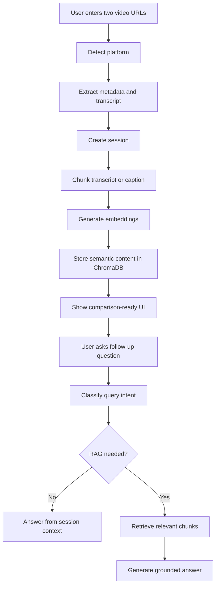
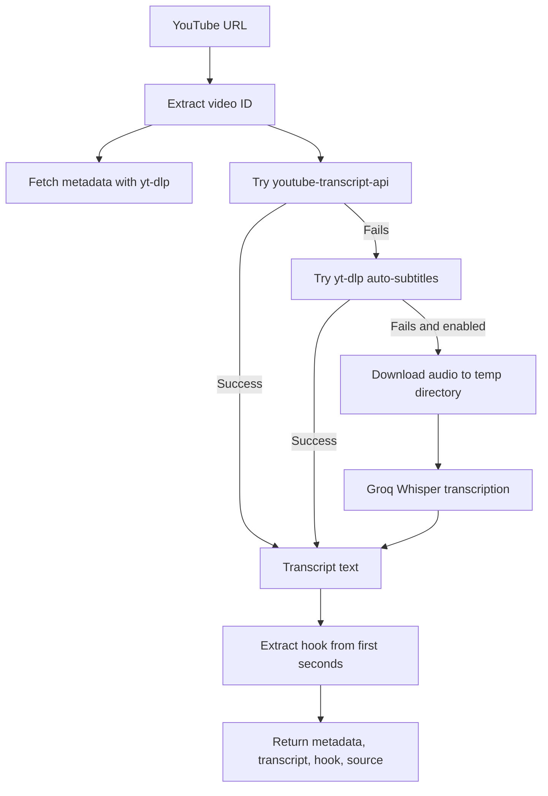
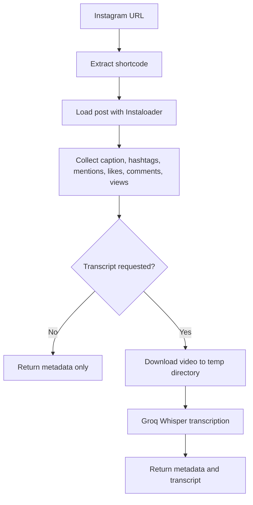
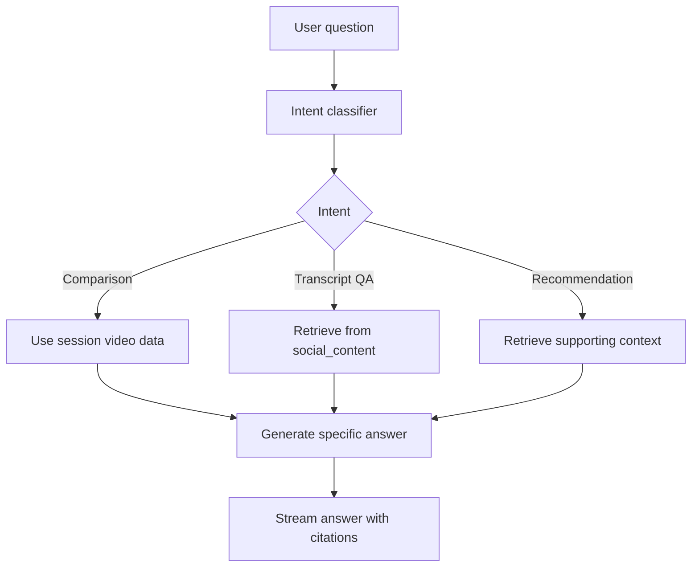
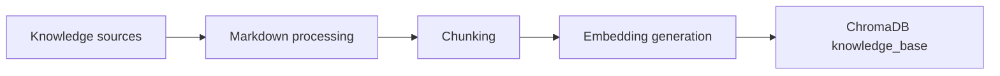
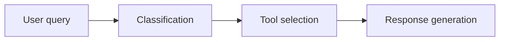

# Auralytix

Auralytix is a social video intelligence app for comparing YouTube and Instagram content. It extracts metadata, transcripts, hooks, and captions, stores useful semantic context, and lets users ask grounded follow-up questions through a session-aware chatbot.

The intended workflow is simple: paste two video URLs, run extraction, compare performance and messaging, then continue asking questions about the videos.

## Features

- YouTube and Instagram extraction
- Metadata capture for views, likes, comments, engagement, duration, upload date, and creator details
- YouTube transcript extraction with yt-dlp auto-subtitle fallback and optional Whisper fallback
- Instagram metadata-first extraction with optional Whisper transcription
- Hook extraction for early-video analysis
- Session-aware chatbot for follow-up analysis
- Selective RAG using ChromaDB
- Knowledge-base pre-ingestion for grounded recommendations
- LangSmith tracing for observability and debugging

## Architecture Highlights

- Fallback extraction handles platform failures, missing captions, and changing APIs.
- Knowledge-grounded recommendations use pre-ingested reference material instead of pure LLM based random suggestions.
- Query classification runs before retrieval, so vector search happens only when useful.
- Tool-based reasoning avoids always-on RAG and keeps simple answers fast.
- Extraction and conversational analysis are separated into dedicated pipelines.
- Retrieval is split into `social_content` and `knowledge_base` collections to reduce noise.
- Structured metrics stay in session data, while transcripts and captions are embedded semantically.
- Disk-Based Temporary Storage Instead of In-Memory Buffers for Whisper fallbacks

Detailed discussion of these engineering decisions is included near the bottom of this README.


### Engagement Rate Calculation

In addition to raw platform metrics, Auralytix computes an engagement rate for Instagram and Youtube content using:

Engagement Rate (%) = ((Likes + Comments) / Views) × 100

This provides a normalized measure of audience interaction that is more meaningful than raw counts alone. By converting engagement into a percentage, content from creators with different audience sizes can be compared more fairly, allowing stronger analysis of content effectiveness and audience response.


## Tech Stack

| Layer | Tools |
|---|---|
| Frontend | React, Vite, Framer Motion, Tailwind setup |
| Backend | FastAPI, LangGraph, Pydantic |
| LLM API | Groq through OpenAI-compatible client |
| Transcription | Groq Whisper, yt-dlp |
| Extraction | yt-dlp, youtube-transcript-api, Instaloader |
| RAG | ChromaDB, BAAI/bge-small-en-v1.5, LangChain text splitters |
| Observability | LangSmith |

## Project Structure

```text
.
├── backend/
│   ├── app.py                  # FastAPI entrypoint
│   ├── graph.py                # LangGraph chat and retrieval workflow
│   ├── routes/api.py           # Extract and chat endpoints
│   ├── rag/                    # Chroma, embeddings, vector storage
│   └── utils/                  # YouTube, Instagram, LLM, session helpers
├── frontend/
│   └── src/                    # React UI and API client
├── RAG_INGESTION_DATA/         # Curated knowledge documents
└── README.md
```

## Environment

Create a `.env` file in the project root:

```env
GROQ_API_KEY=your_key
OPENAI_BASE_URL=https://api.groq.com/openai/v1
OPENAI_MODEL=llama-3.3-70b-versatile

LANGSMITH_TRACING=true
LANGSMITH_API_KEY=your_langsmith_key
LANGSMITH_PROJECT=Auralytix
LANGSMITH_ENDPOINT=https://api.smith.langchain.com
```

## Running Locally

Backend:

```bash
cd backend
pip install -r requirements.txt
python app.py
```

Frontend:

```bash
cd frontend
npm install
npm run dev
```

The frontend proxies `/extract` and `/chat/stream` requests to the backend through Vite.

## Deployment

The project is intended to be deployed as two separate services:

- Frontend: Vercel
- Backend: Render

Keep frontend and backend environment variables separate. After deploying the backend on Render, add the Render backend URL to the Vercel frontend as `VITE_API_BASE_URL`.

### Backend on Render

Backend deploy files:

- `backend/Dockerfile`
- `backend/Procfile`
- `backend/.env.example`

Render start command:

```bash
uvicorn app:app --host 0.0.0.0 --port $PORT
```

Render settings:

| Setting | Value |
|---|---|
| Root directory | `backend` |
| Build command | `pip install -r requirements.txt` |
| Start command | `uvicorn app:app --host 0.0.0.0 --port $PORT` |

Required Render environment variables:

```env
GROQ_API_KEY=your_key
OPENAI_BASE_URL=https://api.groq.com/openai/v1
OPENAI_MODEL=llama-3.3-70b-versatile
LANGSMITH_TRACING=false
```

### Frontend on Vercel

Frontend deploy files:

- `frontend/Dockerfile`
- `frontend/nginx.conf`
- `frontend/.env.example`

Vercel settings:

| Setting | Value |
|---|---|
| Root directory | `frontend` |
| Install command | `npm ci` |
| Build command | `npm run build` |
| Output directory | `dist` |

Local frontend build:

```bash
cd frontend
npm ci
npm run build
```

Build output:

```text
frontend/dist
```

Required Vercel environment variable:

```env
VITE_API_BASE_URL=https://your-backend-domain.com
```

## Core Flow



## YouTube Extraction Flow

YouTube uses a transcript-first pipeline. Captions are preferred because they are fast and cheap. If the transcript API is unavailable, the system tries yt-dlp auto-subtitles before using the optional Whisper fallback.



Why this matters:

- Captions keep normal requests fast.
- yt-dlp auto-subtitles provide a free fallback when the transcript API is blocked or unavailable.
- Whisper fallback is optional and only used when explicitly enabled.
- Temporary files prevent media storage buildup.
- Hook extraction supports better opening-line and retention analysis.

## Instagram Extraction Flow

Instagram is metadata-first. The app collects structured fields immediately, then generates transcript data only when deeper analysis needs it.



Why this matters:

- Most comparisons can start from metadata and captions.
- Whisper is used only when analysis needs deeper content.
- This lowers latency, compute cost, and disk pressure.

## Chat and RAG Flow

The assistant does not retrieve from the vector database for every message. It first classifies the query, then chooses the cheapest useful path.



Supported paths:

- `comparison`: answers from current session data without unnecessary retrieval.
- `transcript_qa`: searches extracted transcripts and captions in `social_content`.
- `recommendation`: uses session context plus retrieved supporting material.


## Metadata-Aware Storage
The app intentionally separates structured metrics from semantic content.
Stored as structured session data:
- views
- likes
- comments
- engagement rate
- duration
- upload date
- creator/channel information

Stored in ChromaDB:
- transcripts
- captions
- curated knowledge chunks

Why it is needed:
- Numeric metrics should be read exactly, not searched semantically.


## API Overview

| Method | Endpoint | Description |
|---|---|---|
| `GET` | `/` | Health check |
| `POST` | `/extract` | Extract and store both videos |
| `POST` | `/chat` | Non-streaming chat response |
| `POST` | `/chat/stream` | Streaming chat response with citations |

Example extract request:

```json
{
  "video_a_url": "https://www.youtube.com/watch?v=...",
  "video_b_url": "https://www.instagram.com/reel/..."
}
```

Example chat request:

```json
{
  "session_id": "active-session-id",
  "query": "Which video has the stronger hook?"
}
```

## Detailed Engineering Decisions

### Knowledge-Grounded Recommendations Through Pre-Ingestion

Most social media analysis tools rely heavily on the LLM's internal knowledge for recommendations. Auralytix avoids making recommendations from model memory alone.

Before users interact with the app, curated reference material is processed and stored in a dedicated knowledge base.



This is used for recommendations such as:

- content improvement suggestions
- marketing insights
- platform strategy
- audience growth advice

Why it is needed:

- Recommendations should be grounded in updateable reference material.
- The app can improve its knowledge without retraining a model.
- Retrieved context makes advice more consistent and explainable.

What makes it unique:

- The recommendation path becomes `LLM + retrieved knowledge`, not just LLM opinion.
- Domain knowledge can be curated, replaced, and expanded independently from the model.

### Query Classification Before Retrieval

Many RAG systems retrieve context for every query. That increases latency, cost, and retrieval noise.

Auralytix classifies each question before retrieval. The classifier determines the user intent, whether retrieval is required, and which collection should be queried.

| Intent | Example | Action |
|---|---|---|
| Comparison | "Compare these videos" | Use session data directly |
| Transcript Analysis | "What did the creator say about AI?" | Retrieve from `social_content` |
| Recommendations | "How can this content perform better?" | Retrieve supporting recommendation context |

Why it is needed:

- Not every question needs vector search.
- Metrics and current-session comparisons are often already available in session state.
- Avoiding unnecessary retrieval improves response speed and quality.

What makes it unique:

- The system behaves more like a decision-making assistant than a fixed RAG pipeline.
- Retrieval is treated as a tool, not a default step.

### Tool-Based Reasoning Instead of Always-On RAG

The LLM acts as a reasoning layer that decides whether a tool is needed.



Possible paths:

- No tool: answer from session context.
- `social_content` retrieval: answer from transcripts, captions, and extracted content.
- `knowledge_base` retrieval: answer with curated strategy or recommendation knowledge.

Examples:

- "Compare these two videos" -> session context only.
- "What did the YouTube creator say about AI?" -> `social_content` retrieval.
- "Suggest improvements for engagement" -> recommendation context retrieval.

Why it is needed:

- It keeps simple answers fast.
- It reduces vector database load.
- It avoids adding irrelevant retrieved chunks to prompts.

What makes it unique:

- The app follows a production-oriented principle: retrieve only when retrieval adds value.

### Separation of Concerns Through Dedicated Pipelines

The app is split into two major workflows instead of one monolithic endpoint.

| Pipeline | Endpoint | Responsibility |
|---|---|---|
| Extraction Pipeline | `POST /extract` | metadata extraction, transcript generation, fallbacks, vector storage, session creation |
| Conversational Analysis Pipeline | `POST /chat`, `POST /chat/stream` | query classification, session retrieval, tool selection, RAG orchestration, response generation |

Why it is needed:

- Extraction and conversation have different failure modes.
- Each pipeline can be debugged, traced, and scaled independently.
- The product flow stays easier to maintain.

What makes it unique:

- Video processing is completed before chat reasoning begins.
- Chat responses can stay focused on analysis instead of mixing extraction concerns into every request.

### Retrieval Collections Designed Around Usage Patterns

Auralytix separates retrieval data by purpose.

| Collection | Contains | Used For |
|---|---|---|
| `knowledge_base` | pre-ingested reference material, best practices, strategy knowledge | recommendations |
| `social_content` | user transcripts, captions, extracted video content | content-specific analysis |

Why it is needed:

- Strategy documents and user transcripts should not compete in the same semantic space.
- Separate collections reduce retrieval contamination.
- Relevance ranking stays cleaner as the dataset grows.

What makes it unique:

- The app retrieves from the collection that matches the user intent.
- This improves precision for both content questions and recommendation questions.

### Metadata-Aware Storage

The system does not blindly embed every extracted field.

Stored as structured session data:

- views
- likes
- comments
- engagement rate
- duration
- upload date
- creator/channel information

Stored in ChromaDB:

- transcripts
- captions
- curated knowledge chunks

Why it is needed:

- Numeric metrics should be read exactly, not searched semantically.
- Embedding metrics wastes storage, embedding time, and retrieval budget.

What makes it unique:

- The system uses the right storage style for each type of information.
- This keeps retrieval smaller, cleaner, and faster.

## Fallback Extraction for Unreliable Platforms
# The problem:
-Social platforms frequently block, change, or degrade API access. Single-point extraction fails too often in production.
# The solution:
Each platform has a primary method and a fallback path.

-YouTube: Transcript API (fast/cheap) -> yt-dlp auto-subtitles (free fallback) -> optional Whisper transcription
-Instagram: Metadata first → Whisper only when deep analysis requested

# What makes this unique: 
-The system expects failure and designs for it. Temporary media storage prevents disk bloat, and fallbacks are automatic.
# Benefit: 
-High reliability without overbuilding infrastructure for edge cases.


## Disk-Based Temporary Storage Instead of In-Memory Buffers for Whisper fallbacks
# The problem:
 When captions are missing or blocked, Whisper transcription requires temporary audio storage. Using BytesIO (in-memory buffers) works for single requests but fails under concurrency. With 1,000 simultaneous users:
 1000 audio files in RAM → Server crashes
 # The solution: 
 Use TemporaryDirectory (disk-based storage) for the Whisper fallback path.
 1000 audio files on disk → RAM stays low → Deleted after transcription


# Recommended future upgrades:
Adding a additional web searching tool to search current trends, which is not necessary as of now for this.

The code is split so these upgrades can be introduced without rewriting the product flow.

## Notes

The main idea behind Auralytix is straightforward: extract reliable video context, store only what benefits retrieval, classify every user question, and answer from the cheapest trustworthy source first.
